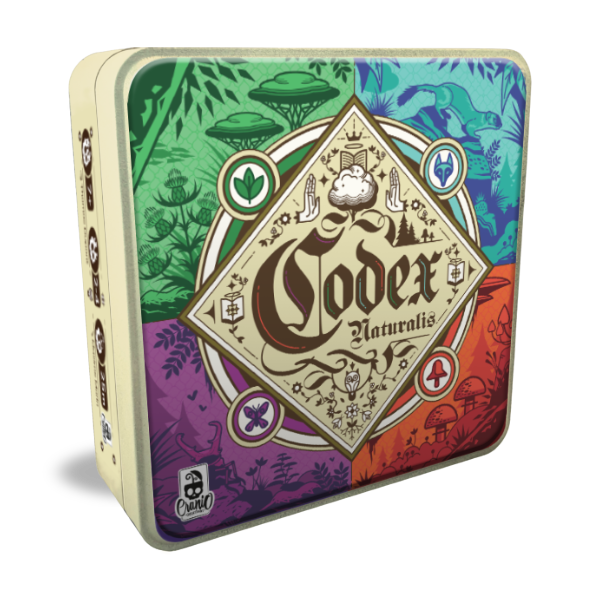

# Codex Naturalis

## Progetto di Ingegneria del Software per il Politecnico di Milano, Anno accademico 2023/2024

Guarda le specifiche [qui](assets/requirements.pdf) e leggi le regole del gioco:
([ita](assets/CODEX_Rulebook_IT.pdf) o [eng](assets/CODEX_Rulebook_EN.pdf))

Per la documentazione riguardante il progetto si veda la [cartella deliverables](deliverables)

Guarda il file dei problemi noti: [Known Issues](KNOWN_ISSUES.txt)

## Team (Gruppo 37)

- [Dario Aliprandi](https://github.com/dario747)
- [Riccardo Bonfanti](https://github.com/BonfantiRiccardo)
- [Alberto Brignola](https://github.com/Alienn717)
- [Alessandro Marzio Carrieri](https://github.com/Marziocarrieri)

### Implemented Functionalities
<table>
<tr><td>

| Functionality    | Status                  |
|:-----------------|:-----------------------:|
|  Basic rules     |  :white_check_mark:     |
|  Complete rules  |  :white_check_mark:     |
|  Socket TCP      |  :white_check_mark:     |
|  RMI             |  :white_check_mark:     |
|  CLI             |  :white_check_mark:     |
|  GUI             |  :white_check_mark:     |
|  Multiple games  |  :white_check_mark:     |
|  Chat            |  :no_entry:             |
|  Persistence     |  :no_entry:             |
|  Resilience      |  :no_entry:             |

</td>
</tr>
</table>

### Legend
:no_entry: Not Implemented &nbsp;&nbsp;&nbsp;&nbsp;:alarm_clock: To be Implemented &nbsp;&nbsp;&nbsp;&nbsp; :gear: Implementing&nbsp;&nbsp;&nbsp;&nbsp;:white_check_mark: Implemented

# How to Run
1. Go to /out/artifacts/AM37_jar folder
2. Download the .jar files of the server and the client

3. Open the terminal and launch the server -> `java -jar Server_Codex_Naturalis.jar TCPport RMIport`  (where TCPport and RMIport are whatever ports you want to open for connection)
4. Launch the clients in another terminal: specify which user interface (UI) you want to play with ("gui" or "tui") and the connection protocol (PROTOCOL) you want to play with ("tcp" or "rmi")  
-> `java -jar Client_Codex_Naturalis.jar ServerIP PORT UI PROTOCOL`  (where ServerIP is the address of the server and PORT is the port of the server that is open for connaction for the specified protocol)
